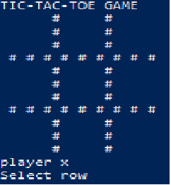

# Tic-Tac-Toe Game

Tic-tac-toe, noughts and crosses, or Xs and Os is a paper-and-pencil game for two players, X and O, who take turns marking the spaces in a 3×3 grid. The player who succeeds in placing three of their marks in a horizontal, vertical, or diagonal row is the winner.

## RULES FOR TIC-TAC-TOE

1. The game is played on a grid that's 3 squares by 3 squares.

2. You are X, your friend is O. Players take turns putting their marks in empty squares.

3. The first player to get 3 of her marks in a row (up, down, across, or diagonally) is the winner.

4. When all 9 squares are full, the game is over. If no player has 3 marks in a row, the game ends in a tie.

## 🛠 Getting Started

> To get a local copy of the game and running it, follow these simple steps.

- Go to the main page of the repo. [Repository](https://github.com/Nexch/TicTac/tree/master)
- Press the "Code" button and copy the repo link.
- Clone it using git clone in your terminal.

### 📝 Prerequisites

- Ruby -v2.7.0p0

### 📝 Setup

- Open a terminal
- Go to the folder where you want to save it.
- Copy this code :
  `git clone "put the link from github repo"`
- Run the program with this code :
  `bin/main`

### 📝 How To Play

- When run the game an empty board will shown:

- Have the first player go first. Though traditionally, the first player goes with "X"

- Enter the number of the row and then enter the number of the colummn where you want your move.

- Have the second player go second. The second player goes with "O"

- Enter the number of the row and then enter the number of the colummn where you want your move.

- Keep alternating moves until one of the players win

- Or Keep alternating moves until the players Tied and no one when

## 🔧 Built With

- Ruby v.2.7.0p0
- Using Linters for Ruby Rubocop.
- Github.

### Usage

- Personal Project - Create a Tic-Tac-Toe-Game to run basic concepts of Ruby language just for learning propose.

## 👤 Authors

👤 Brian Sammit Cruz Rodriguez

Github: [@BrianSammit](https://github.com/BrianSammit)

Twitter: [@CruzSammit](https://twitter.com/CruzSammit)

Linkedin: [Brian Sammit](https://www.linkedin.com/in/brian-sammit-cruz-rodriguez-5877551a8/)

👤 **Mauricio Tavile**

- Github: [@janis-jenny](https://github.com/Nexch)

- Twitter: [@janis_jenny](https://twitter.com/MfinchT)

- Linkedin: [linkedin](https://www.linkedin.com/in/Nexch/)

## 🤝 Contributing

Contributions, issues and feature requests are welcome!

Feel free to check the [issues page](issues/).

## Show your support

Give a ⭐️ if you like this project!

## Acknowledgments

- Hat tip to anyone whose code was used
- Inspiration
- etc

## 📝 License

This project is [MIT](lic.url) licensed.
